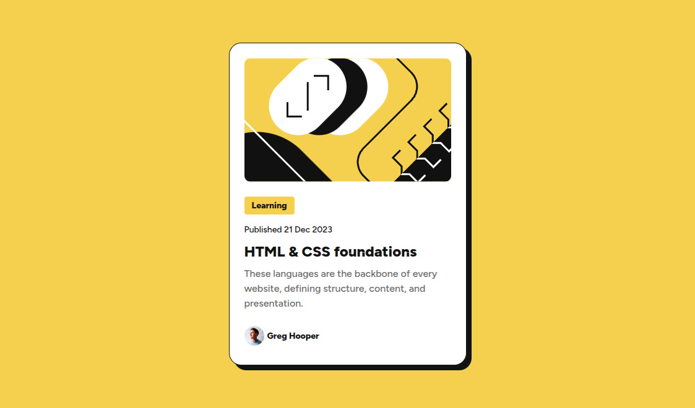

# Frontend Mentor - Blog preview card solution

This is a project made to the [Blog preview card challenge on Frontend Mentor](https://www.frontendmentor.io/challenges/blog-preview-card-ckPaj01IcS). Status: Finished.

## Table of contents

- [Overview](#overview)
  - [Screenshot](#screenshot)
  - [Links](#links)
- [My process](#my-process)
  - [Built with](#built-with)
  - [What I learned](#what-i-learned)
  - [Continued development](#continued-development)
  - [Useful resources](#useful-resources)
- [Author](#author)

## Overview

### Screenshot

### Links

Live Site URL: [Live on Github Pages](https://luizhen527.github.io/blog-preview-card/)
<!-- - Solution URL: [Add solution URL here](https://your-solution-url.com)
- Live Site URL: [Add live site URL here](https://your-live-site-url.com) -->

## My process

### Built with

- Semantic HTML5 markup
- CSS custom properties
- Flexbox

### What I learned

- How to use media queries;
- How to make a good use of css custom properties in media queries.

### Continued development

These are the things I still need to get better at or study more about:

- How to develop a mobile first layout;
- Study component based design in css (Container queries)

### Useful resources

[How to use media queries by Kevin Powell](https://www.youtube.com/watch?v=2rlWBZ17Wes&t=10s) - Great video about media queries. He also explain about container queries. I got curious about container queries, interesting concept.
<!-- - [Example resource 1](https://www.example.com) - This helped me for XYZ reason. I really liked this pattern and will use it going forward.
- [Example resource 2](https://www.example.com) - This is an amazing article which helped me finally understand XYZ. I'd recommend it to anyone still learning this concept. -->

## Author

- Frontend Mentor - [@LuizHen527](https://www.frontendmentor.io/profile/LuizHen527)
- Linkedin - [@luizhen765](https://www.linkedin.com/in/luizhen765/)